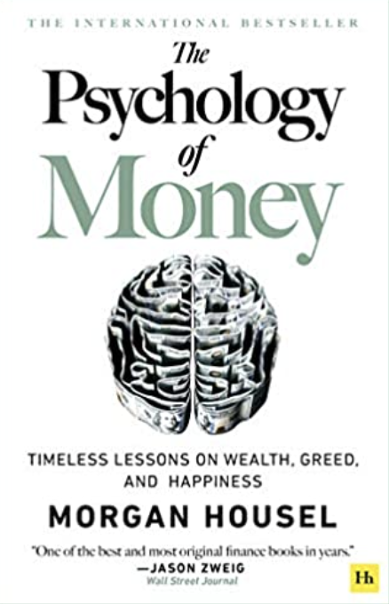

---
tags:
---

# The Psychology of Money
## Timeless lessons on wealth, greed, and happiness

> A genius is a human who can do the average thing when everyone else around him is losing its mind - *Napoleon*

Length: 200 pages (kindle edition)

Content in 3 sentences:

Authors: Morgan Housel

Best 3 Insights:

Web: https://www.amazon.de/Housel-Psychology-Timeless-Lessons-Happiness/dp/0857197681/ref=asc_df_0857197681/?tag=googshopde-21&linkCode=df0&hvadid=427693549427&hvpos=&hvnetw=g&hvrand=800003947327503057&hvpone=&hvptwo=&hvqmt=&hvdev=c&hvdvcmdl=&hvlocint=&hvlocphy=9042079&hvtargid=pla-947774987444&psc=1&th=1&psc=1&tag=&ref=&adgrpid=98370309294&hvpone=&hvptwo=&hvadid=427693549427&hvpos=&hvnetw=g&hvrand=800003947327503057&hvqmt=&hvdev=c&hvdvcmdl=&hvlocint=&hvlocphy=9042079&hvtargid=pla-947774987444

Content:

