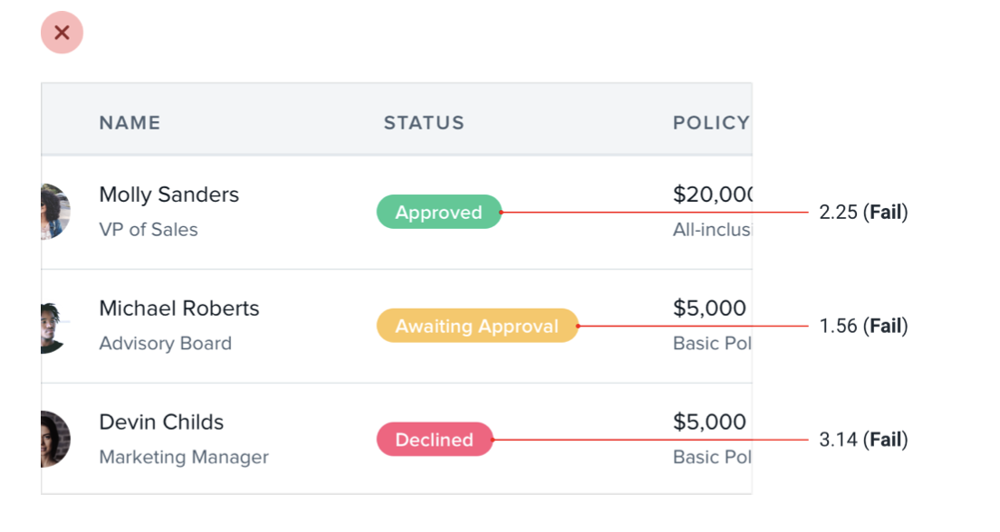
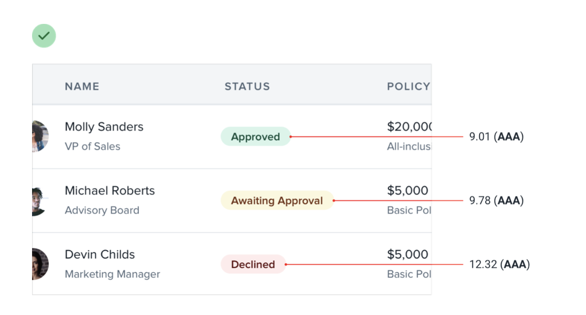
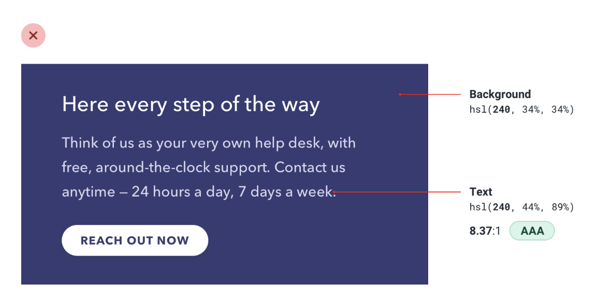
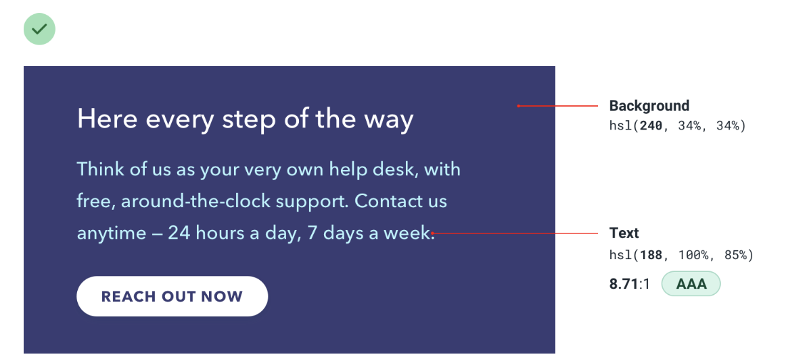

--- 
tags:
---

# Accessible doesn't have to mean ugly

To stay accessible according to the WCAG (Web Content Accessibility Guidelines), instead of using light text on dark background, use dark text on light background.

When working with colored text on colored backgrounds, its hard to not come to pure white, when wanting to meet the standards. Instead, rotate hue on text

---
References:
[[refactoring-ui]]
[[working-with-color]]

[//begin]: # "Autogenerated link references for markdown compatibility"
[refactoring-ui]: refactoring-ui.md "Refactoring UI"
[working-with-color]: structure/working-with-color.md "Working with color"
[//end]: # "Autogenerated link references"