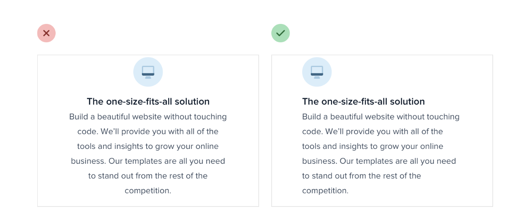
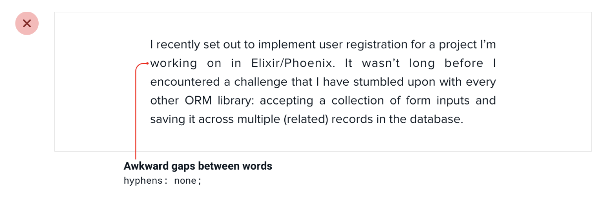
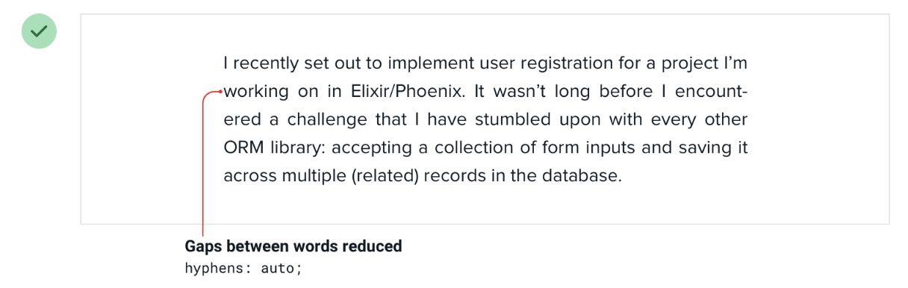

--- 
tags: working-with-text
---

# Align with readability in mind.

Align text according to the language -> english left aligned
Use other alignments wisely.

- Don't center long form text
  
- Right align numbers
- Hyphenate justified text 
  
  

---
References:
[[refactoring-ui]]

[//begin]: # "Autogenerated link references for markdown compatibility"
[refactoring-ui]: refactoring-ui.md "Refactoring UI"
[//end]: # "Autogenerated link references"