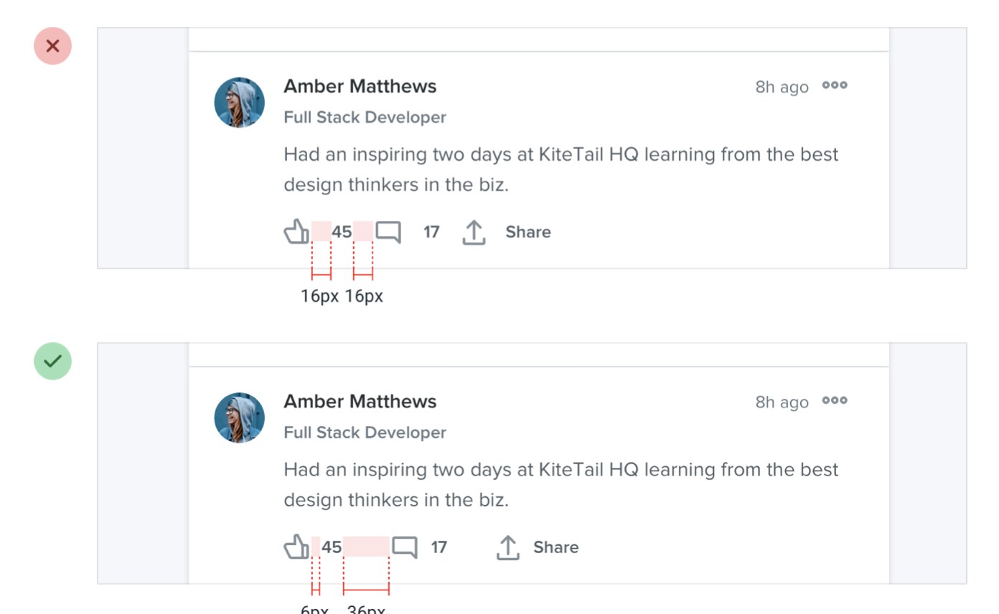

--- 
tags:
---

# Avoid ambiguous spacing

Whenever you use space to separate a group from another, make sure, there is more space around the group, than within.

---
References:
[[refactoring-ui]]
[[layout-and-spacing]]

[//begin]: # "Autogenerated link references for markdown compatibility"
[refactoring-ui]: refactoring-ui.md "Refactoring UI"
[layout-and-spacing]: structure/layout-and-spacing.md "Layout and Spacing"
[//end]: # "Autogenerated link references"