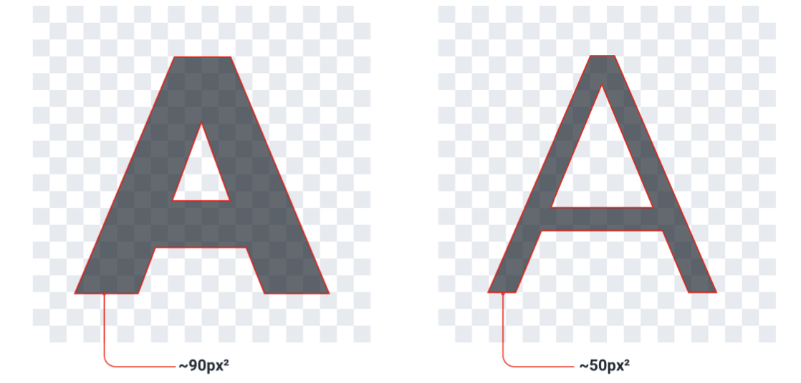
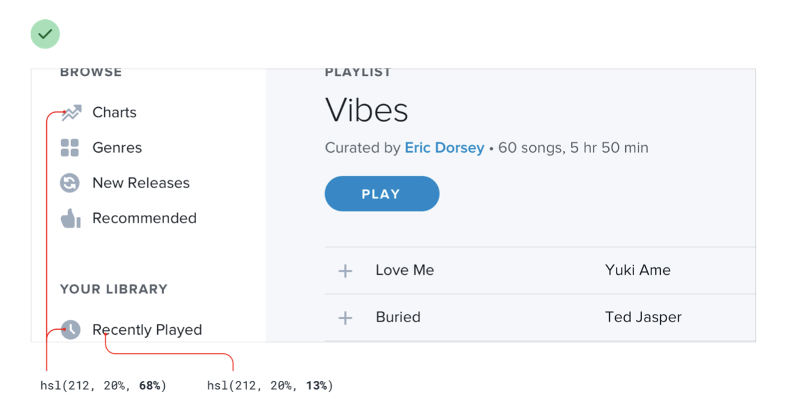
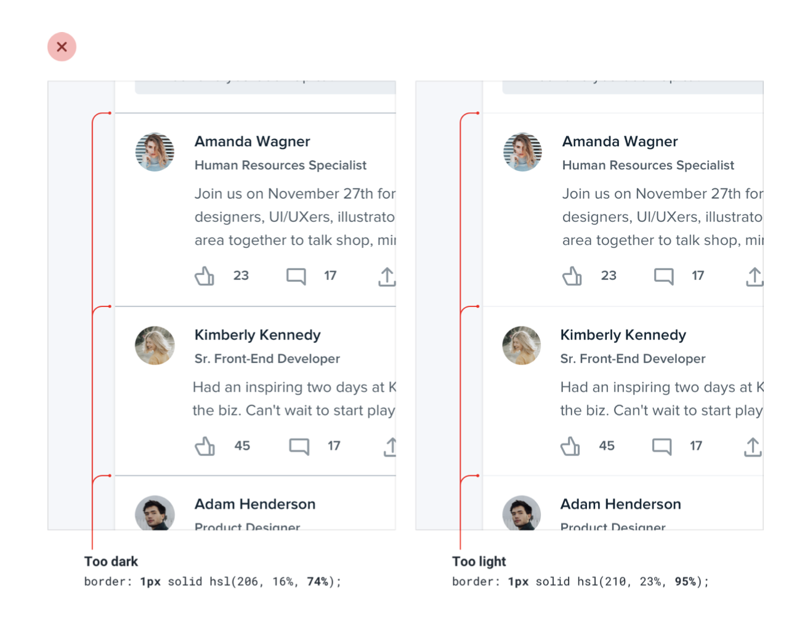
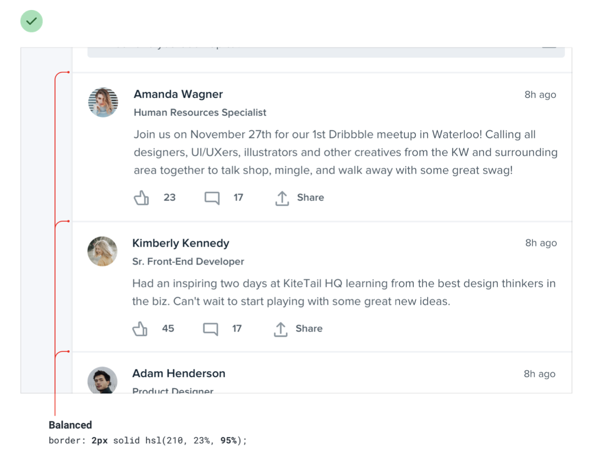

--- 
tags:
---

# Balance weight and contrast

Elements seem heavy weighted, when covering a big amount of screen

- *compensate weight* (screen area covered) with de-emphasizing in the contrast the element has to its surroundings. This comes in handy when working with icons, where weight can not be changed so easily.

- *compensate contrast* (color too light, too dark) with emphasizing the weight of the element, e.g. making it bigger.

---
References:
[[refactoring-ui]]
[[balance-weight-contrast]]

[//begin]: # "Autogenerated link references for markdown compatibility"
[refactoring-ui]: refactoring-ui.md "Refactoring UI"
[balance-weight-contrast]: balance-weight-contrast.md "Balance weight and contrast"
[//end]: # "Autogenerated link references"