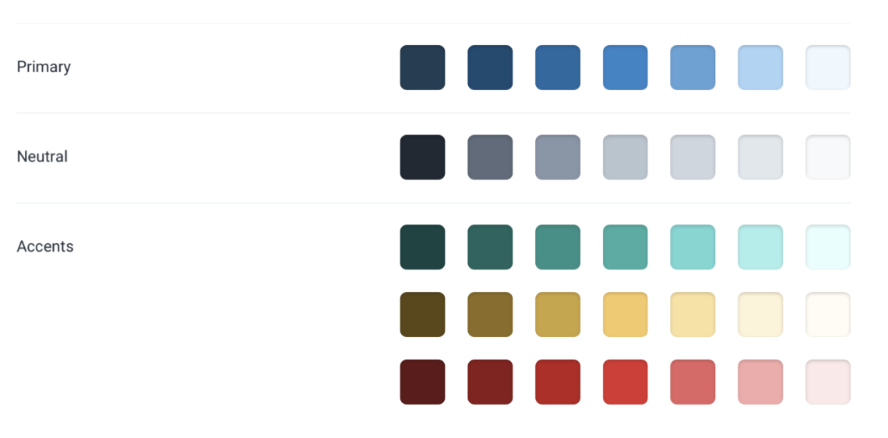
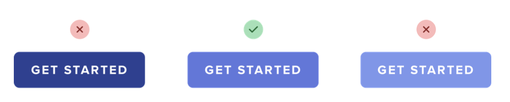
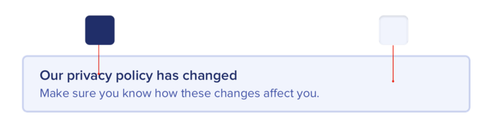
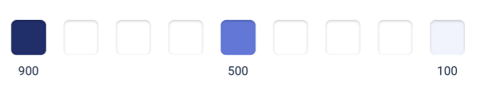
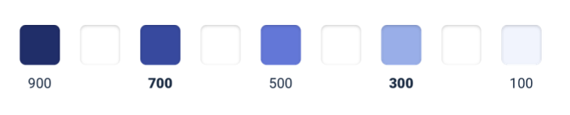
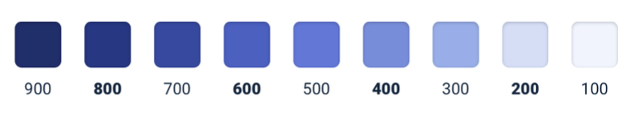

--- 
tags: working-with-color
---

# Define your shades up front

Don't use css preprocessors.
Pick by hand.

For one hue (primary, accent, grey):

Start with base primary color shade, something that would look good on a button. 

Choose the edges, based on how they would look like in action, for example on a alert window.

FIll in the gaps, by first filling the quarter shades, and then the rest.

Again, its not about math, its about what looks good.

---
References:
[[refactoring-ui]]
[[working-with-color]]

[//begin]: # "Autogenerated link references for markdown compatibility"
[refactoring-ui]: refactoring-ui.md "Refactoring UI"
[working-with-color]: structure/working-with-color.md "Working with color"
[//end]: # "Autogenerated link references"