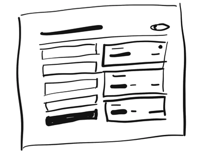

--- 
tags:
---

# Detail comes later

Once you decided on a feature [[start-with-a-feature]],  start sketching the feature with pen and paper so you don't get messed up in details like font size and icons.
Hold back the color, start designing hierarchy with grayscale, that should work as well. Colors are only to enhance.

---
References:
[[refactoring-ui]]

[//begin]: # "Autogenerated link references for markdown compatibility"
[start-with-a-feature]: start-with-a-feature.md "Start with a feature, not a layout"
[refactoring-ui]: refactoring-ui.md "Refactoring UI"
[//end]: # "Autogenerated link references"