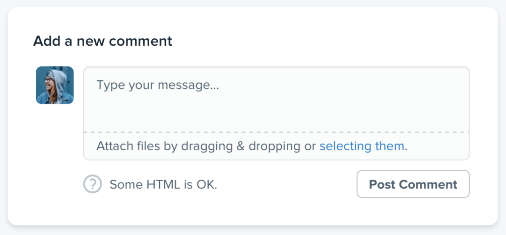
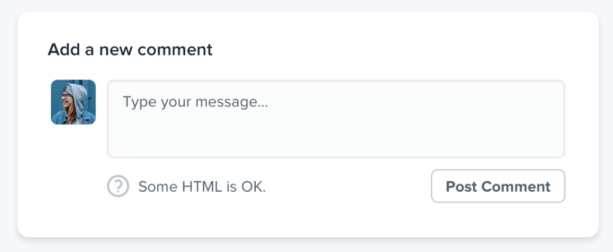

--- 
tags:
---

# Don't design too much

Only start with the very essentials of the feature you want to design. Everything for which you are not ready to code (lack of time etc.) but already exists in design could slow down development and design in turn.
When feature evolves, come back to drawing board, add new aspect and implement it.

## An example
The file attachment takes way to much time to be implemented.

So leave it out

---
References:
[[refactoring-ui]]

[//begin]: # "Autogenerated link references for markdown compatibility"
[refactoring-ui]: refactoring-ui.md "Refactoring UI"
[//end]: # "Autogenerated link references"