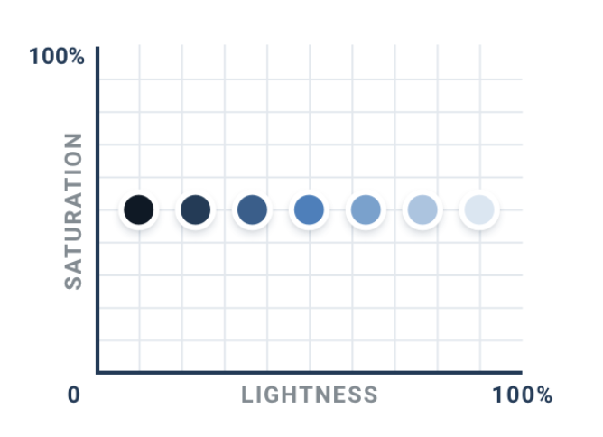
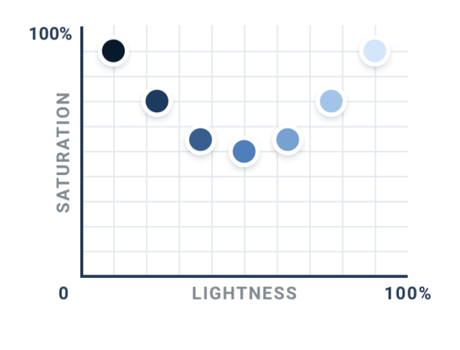
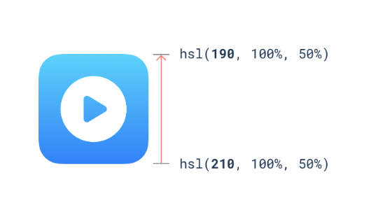
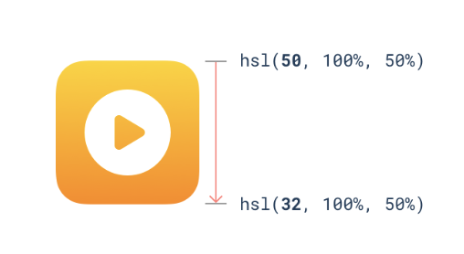

--- 
tags:
---

# Don't let lightness kill your saturation

When creating a color palette with adjusting lightness from a starting point, lighter or darker shades look washed out, even if they have same saturation.

Instead, increase saturation when selecting colors for edge of color palette

 
Different colors have different perceived brightness although having the same saturation and lightness. When we want to change the perceived brightness, do not change the lightness of the color, change the hue towards the brighter hue. To make color darker, change hue towards darker color.

---
References:
[[refactoring-ui]]
[[working-with-color]]

[//begin]: # "Autogenerated link references for markdown compatibility"
[refactoring-ui]: refactoring-ui.md "Refactoring UI"
[working-with-color]: structure/working-with-color.md "Working with color"
[//end]: # "Autogenerated link references"