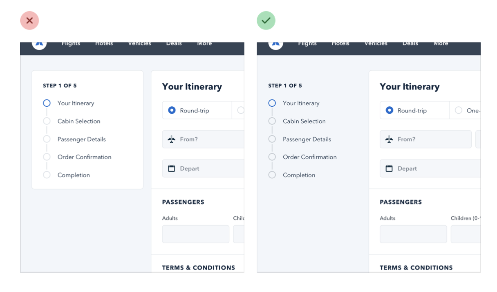
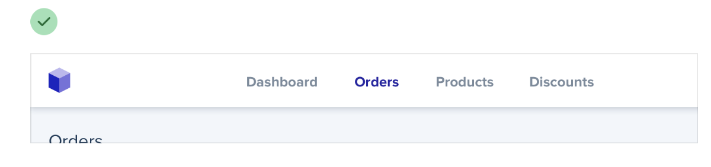

--- 
tags:
---

# Emphasize by de-emphasizing

Instead of trying to add pop to elements that have to stick out, try to reduce pop on elements that should not pop out. This works with small things but also with bigger layout elements.

Good Example for de-emphasize text

---
References:
[[refactoring-ui]]
[[hierarchy-is-everything]]

[//begin]: # "Autogenerated link references for markdown compatibility"
[refactoring-ui]: refactoring-ui.md "Refactoring UI"
[hierarchy-is-everything]: structure/hierarchy-is-everything.md "Hierarchy is everything"
[//end]: # "Autogenerated link references"