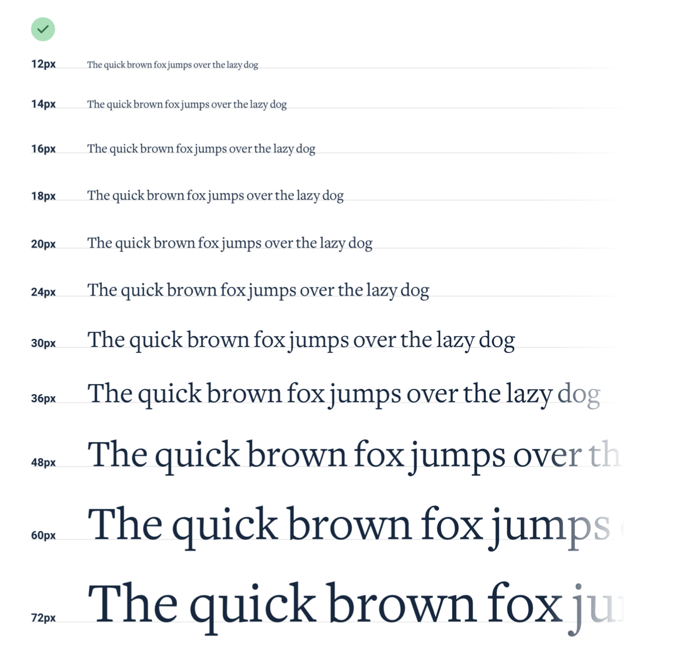

--- 
tags: working-with-text
---

# Establish a type scale

To avoid that every text body / heading in UI has different pixel sizes, establish a limited - not too limiting - number of font sizes to choose from.
Linear wont work since we want a larger amount of smaller font sizes to choose from but don't want to choose between 3 nearly identical heading font sizes.
Option: 
- Mathmatical formula: using 4:5, 2:3 ratio to scale different font sizes from base font size. 
    *Problem* -> You do not always get integer pixel values
- Hand pick Font sizes: One example pic would be

As a rule of thumb, pick 10-12 different font sizes.
Also when establishing a type scale, avoid em / relative units.
Use pixels or rem instead.

---
References:
[[refactoring-ui]]

[//begin]: # "Autogenerated link references for markdown compatibility"
[refactoring-ui]: refactoring-ui.md "Refactoring UI"
[//end]: # "Autogenerated link references"