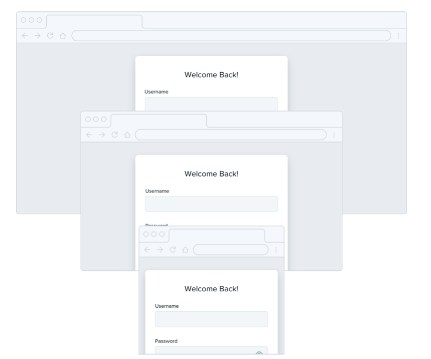

--- 
tags:
---

# Grids are overrated

Don't stick to grids religiously. For example grid based sidebar could get to wide or to small when changing screen ratios. 
Define a max with for elements and define where they shrink to when they shrink.

---
References:
