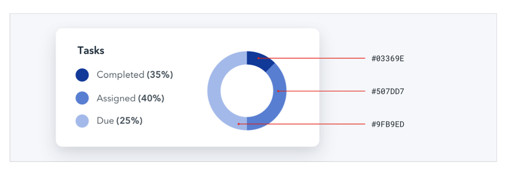
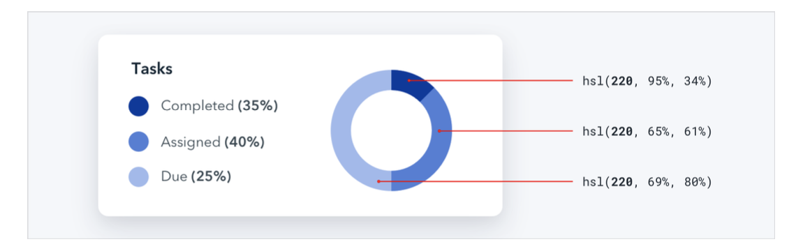

--- 
tags: working-with-color
---

# Ditch hex for HSL

What is HSL: [[hsl-explained]]

Use HSL in favor of hex, since in hex colors which are close to each other do not look close *in code*.
- Hex:
  
- HSL:
  
---
References:
[[refactoring-ui]]

[//begin]: # "Autogenerated link references for markdown compatibility"
[hsl-explained]: hsl-explained.md "HSL"
[refactoring-ui]: refactoring-ui.md "Refactoring UI"
[//end]: # "Autogenerated link references"