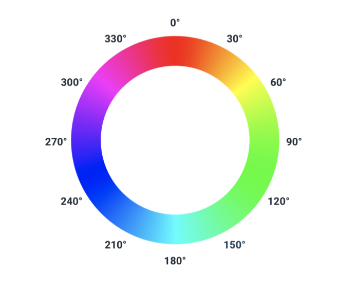
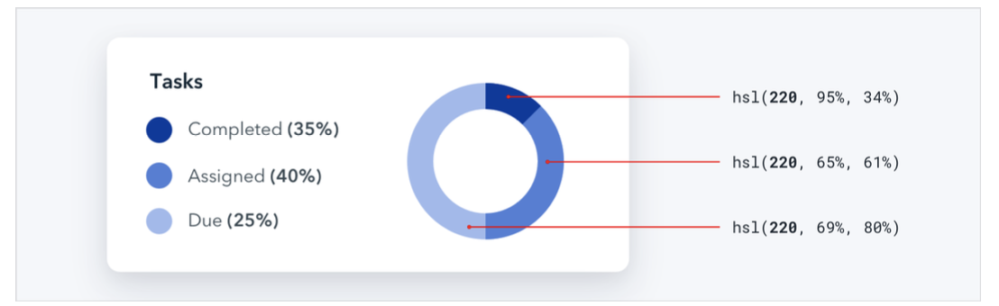
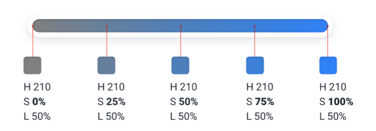
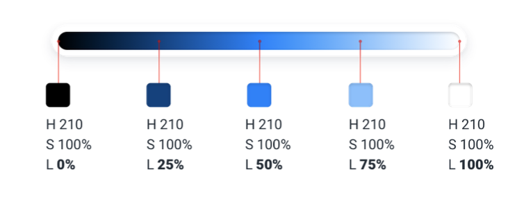

--- 
tags: color-theory, color
---

# HSL

HSL represents color using attributes the human eye can see:
- hue: colors position on the color wheel. It is measured in degrees, where 0° is red, 120° is green, 240° is blue.
  
  
- saturation: how vivid the color looks, 0% saturation is grey. Desaturated, every hue looks the same.
  
- lightness: how close is a color to pure black or pure white. 50% lightness is pure color in the hue.
  

IMPORTANT: Browsers only understand HSL. Not HSB.
---
References:
[[refactoring-ui]]

[//begin]: # "Autogenerated link references for markdown compatibility"
[refactoring-ui]: refactoring-ui.md "Refactoring UI"
[//end]: # "Autogenerated link references"