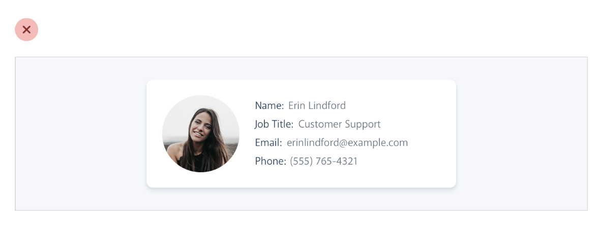
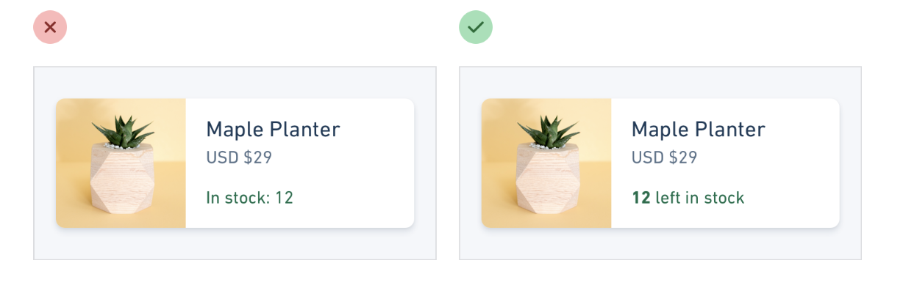
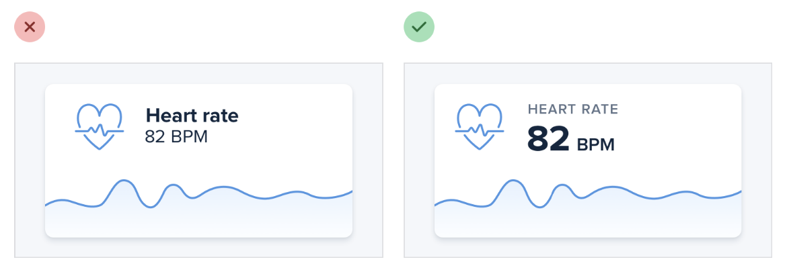

--- 
tags:
---

# Labels are a last resort

Don't use *key:value* on frontend display. This makes it hard to introduce hierarchy to different pieces of information.

Maybe you don't even need a label, context or format of value already gives it away.

If you have to use labels, combine them with the value in a need way, or de-emphasize it, and let the value stick out, since this is what counts, the label is just for further clarification.

---
References:
[[refactoring-ui]]
[[hierarchy-is-everything]]

[//begin]: # "Autogenerated link references for markdown compatibility"
[refactoring-ui]: refactoring-ui.md "Refactoring UI"
[hierarchy-is-everything]: structure/hierarchy-is-everything.md "Hierarchy is everything"
[//end]: # "Autogenerated link references"