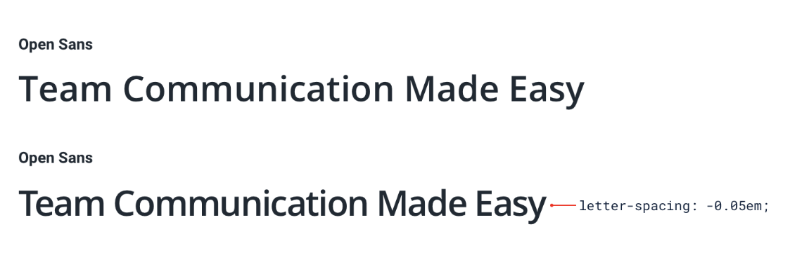
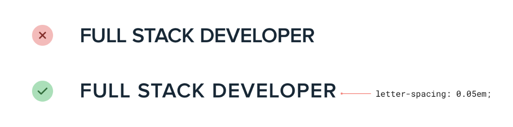

--- 
tags: working-with-text
---

# Use letter-spacing effectively

Leave letter spacing as is, since font designer usually know what they do.

Two occasions, where letter-spacing can be adjusted:
- Tightening headlines: When using wide font for headlines, makes sense to decrease letter spacing.
  
- Improve all-caps: When using all caps text, often makes sense to increase letter spacing, since letters have little distinction
  

---
References:
[[refactoring-ui]]
[[design-text]]

[//begin]: # "Autogenerated link references for markdown compatibility"
[refactoring-ui]: refactoring-ui.md "Refactoring UI"
[design-text]: structure/design-text.md "Designing text"
[//end]: # "Autogenerated link references"