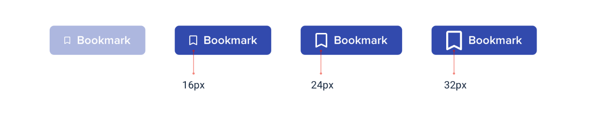

--- 
tags:
---

# Limit your choices

When designing with no boundaries reduce the numbers of choices for each decision you make.
This affects all aspects of weg design; text height, opacity, font weight, margin...

E.g. Define set of blue tones to choose from - not the whole color picker

If decision has to be made, do it in an way of elimination. Take 3 choices next to each other and pic the best looking one. If it is the outer one, just to be sure, take the next e.g. bigger one, to check if this would look even more good. 

Here the left three buttons where the initial comparison, with the 24px looking best, and then adding the 32px to be sure.

Build these comparison and choice limiting systems for everything.
---
References:
[[refactoring-ui]]
[[starting-from-scratch]]

[//begin]: # "Autogenerated link references for markdown compatibility"
[refactoring-ui]: refactoring-ui.md "Refactoring UI"
[starting-from-scratch]: structure/starting-from-scratch.md "Starting from scratch"
[//end]: # "Autogenerated link references"