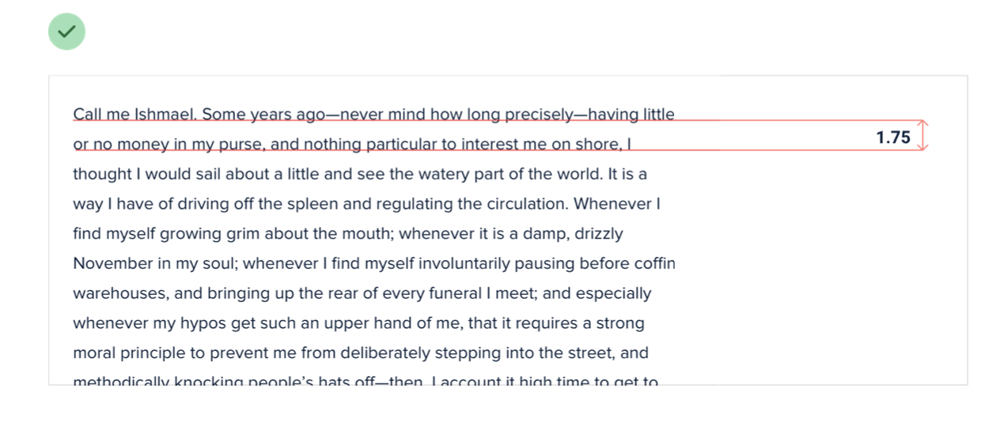

--- 
tags: working-with-text
---

# Line-height is proportional

When choosing line-height for paragraphs:
- *look at line length*: Longer line, greater line height.
  
- *look at font size*: Smaller font size, greater line height.
  
  

---
References:
[[refactoring-ui]]

[//begin]: # "Autogenerated link references for markdown compatibility"
[refactoring-ui]: refactoring-ui.md "Refactoring UI"
[//end]: # "Autogenerated link references"