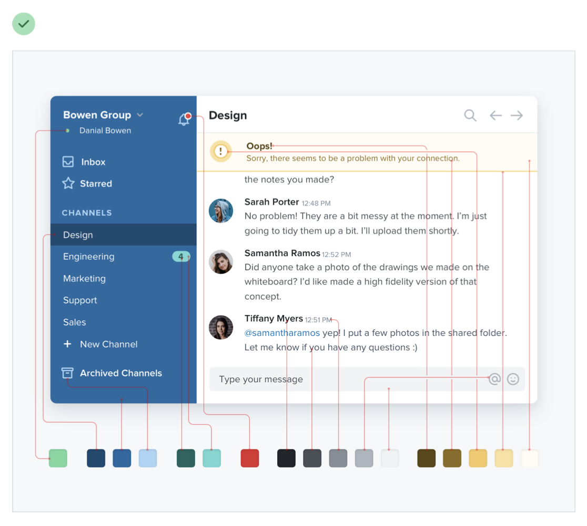
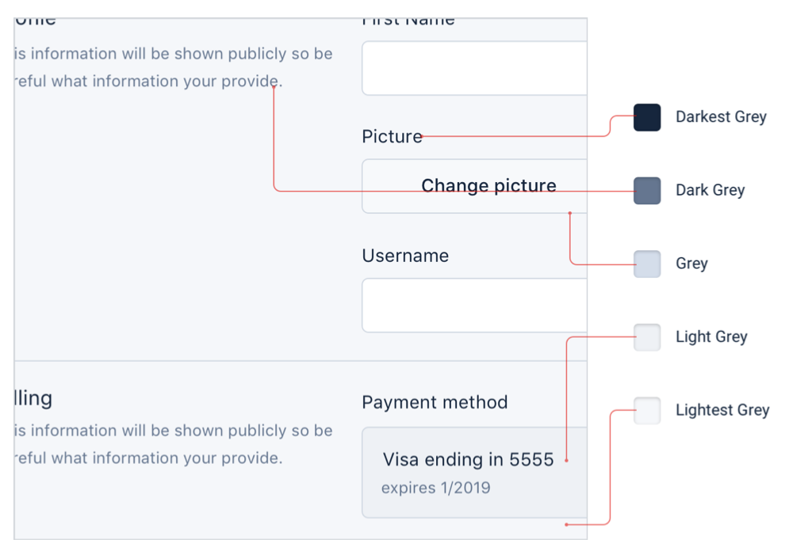
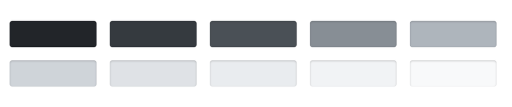
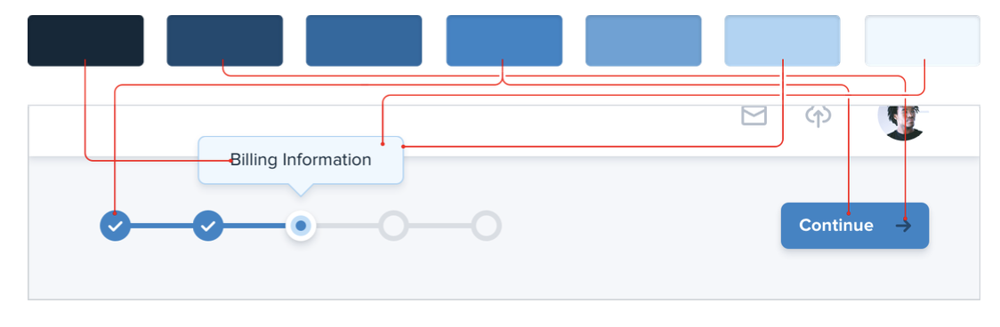
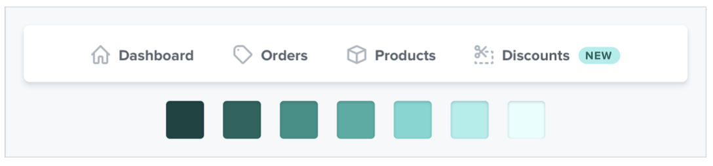
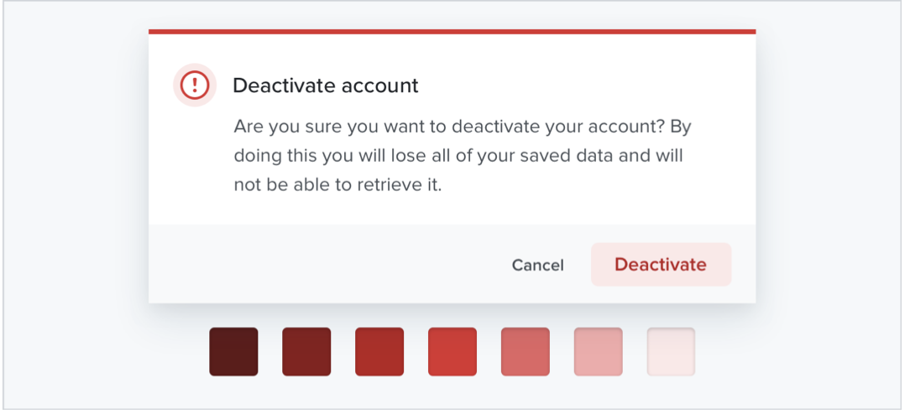
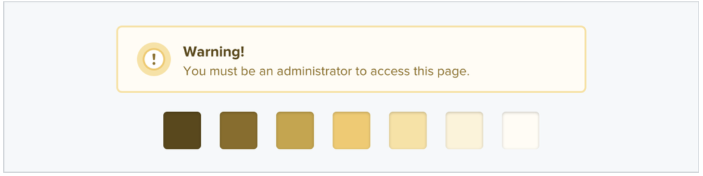
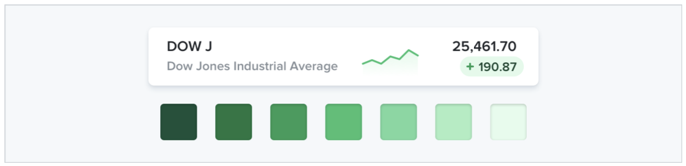

--- 
tags: working-with-color
---

# You need more colors than you think

You can't build something good with just 5 hex codes. 

What you need
- Greys: almost everything is grey.
  
  8-10 Shades as described in [[define-color-shades]].
  
- Primary: primary actions, active navigation etc. (5-10)
  
- Few Accent colors: communicating all sorts of things
  
  
  
  

Use them pretty rare in the ui, only when applicable and necessary

  

---
References:
[[refactoring-ui]]
[[working-with-color]]

[//begin]: # "Autogenerated link references for markdown compatibility"
[define-color-shades]: define-color-shades.md "Define your shades up front"
[refactoring-ui]: refactoring-ui.md "Refactoring UI"
[working-with-color]: structure/working-with-color.md "Working with color"
[//end]: # "Autogenerated link references"