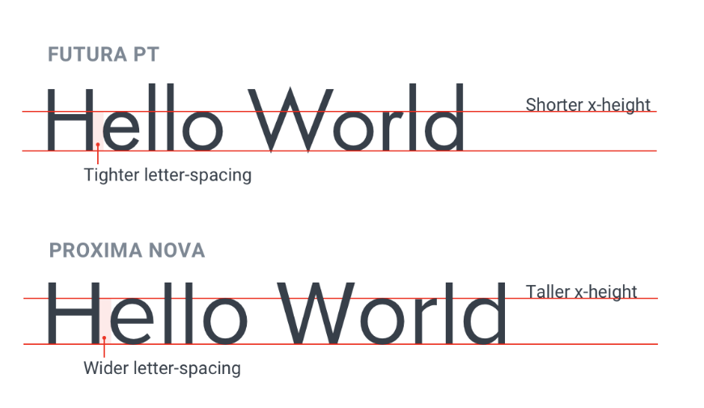

--- 
tags:
---

# Use good fonts

How to filter font directories?
- Ignore typefaces with less than five weights -> Filter for 10 to have italics as well
  
Heading fonts have tighter letter spacing and shorter x-height, corpus fonts have the opposite

---
References:
[[refactoring-ui]]

[//begin]: # "Autogenerated link references for markdown compatibility"
[refactoring-ui]: refactoring-ui.md "Refactoring UI"
[//end]: # "Autogenerated link references"