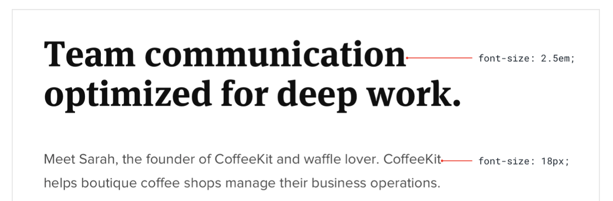
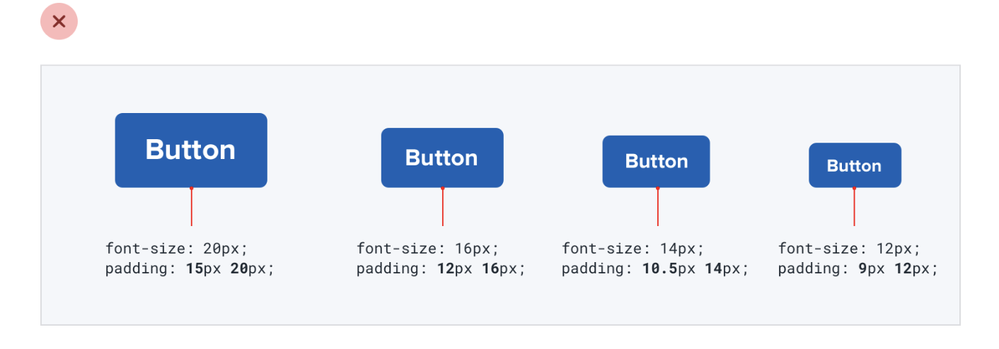

--- 
tags:
---

# Relative sizing doesn't scale

Large elements on large screens need to shrink more on smaller screen, than elements that are already small.
The difference between the two smallest and the largest element should not be that big on small screen than it is on large screens 

Some things do not need to scale proportionally. For example padding and font size of a button. Adjust sizes of different attributes according to context.

Makes the button actually feel like its a smaller or larger button rather than just zoomed.

---
References:
[[refactoring-ui]]
[[layout-and-spacing]]

[//begin]: # "Autogenerated link references for markdown compatibility"
[refactoring-ui]: refactoring-ui.md "Refactoring UI"
[layout-and-spacing]: structure/layout-and-spacing.md "Layout and Spacing"
[//end]: # "Autogenerated link references"