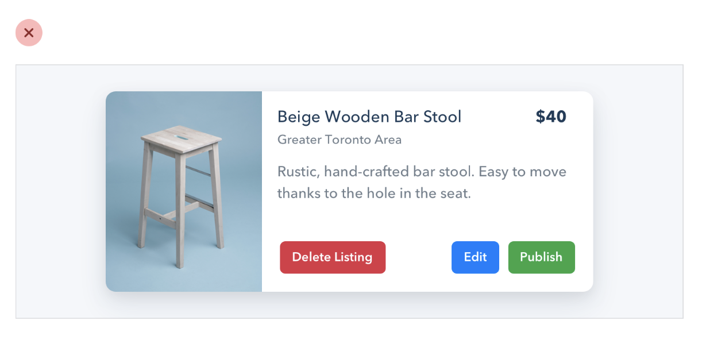
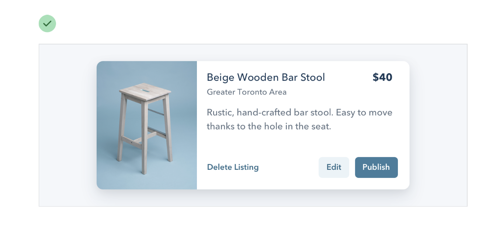

--- 
tags:
---

# Semantics are secondary

Do not design buttons solely based on semantics. 

They should fit in a action hierarchy based on the frequency they are used
- *obvious* Primary actions: High contrast, solid, color
- *clear* Secondary actions: outline style or lower contrast.
- *discoverable* Tertiary actions: style like links for example

This is also true for desctructive actions. If its not the primary button, it should not be big, red and high on contrast. If they are the primary button, go for it.

---
References:
[[refactoring-ui]]

[//begin]: # "Autogenerated link references for markdown compatibility"
[refactoring-ui]: refactoring-ui.md "Refactoring UI"
[//end]: # "Autogenerated link references"