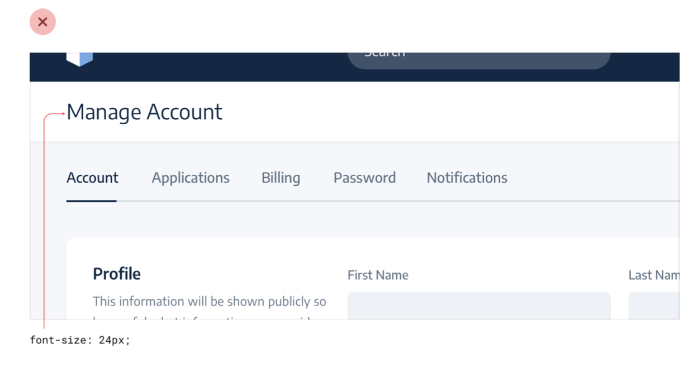
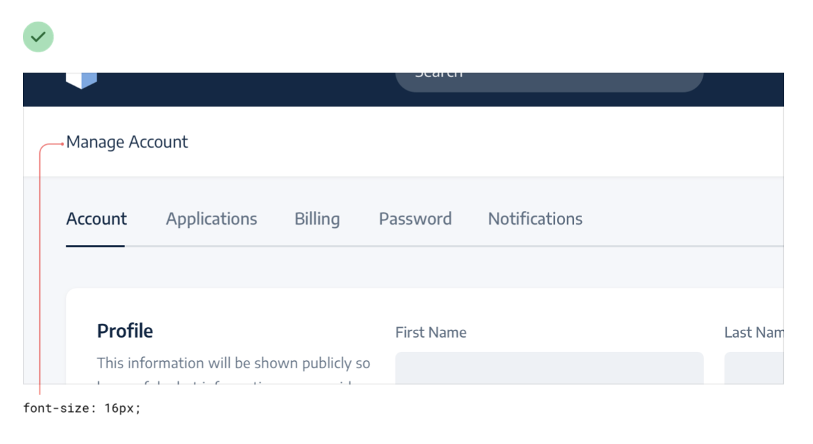

--- 
tags:
---

# Separate visual hierarchy from document hierarchy

Often the *semantic* hierarchy (Heading for "Manage Account" section) intuitively makes sense to be bigger. In fact, its the other way round. The headings often can be seen as labels and thus should be kept smaller (see also: [[labels-are-last-resort]]). This way they align better with the *visual* hierarchy you want to achieve. 
In an exaggerated way, you can remove semantic elements completely and let the content speak for itsself.

---
References:
[[refactoring-ui]]
[[hierarchy-is-everything]]

[//begin]: # "Autogenerated link references for markdown compatibility"
[labels-are-last-resort]: labels-are-last-resort.md "Labels are a last resort"
[refactoring-ui]: refactoring-ui.md "Refactoring UI"
[hierarchy-is-everything]: structure/hierarchy-is-everything.md "Hierarchy is everything"
[//end]: # "Autogenerated link references"