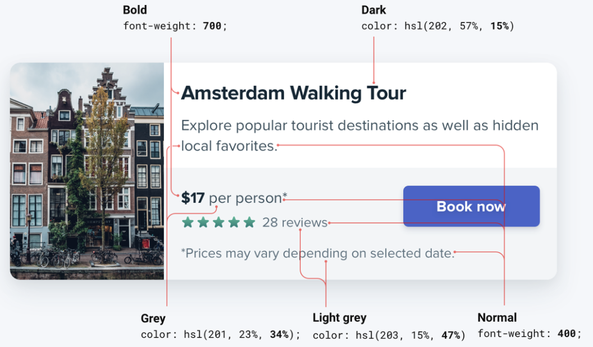

--- 
tags:
---

# Size isn't everything

Don't rely on font size only for ordering information importance in a hierarchy. Instead use font color and font weight.

Example: Use same font size with lighter color implies that text is secondary without loosing readability. Using font with bold font weight, immediately implies importance without having to change the font size.
 
 As a rule of thumb:
 - 3 Colors for text: Dark for highights, grey for secondary, light grey for tertiary information. But [[dont-user-grey-text]].
 - 2 Font weights for text: normal for most text (400-500), heavier (600-700) for text.

Bad:

Good, refactored:

---
References:
[[refactoring-ui]]

[//begin]: # "Autogenerated link references for markdown compatibility"
[dont-user-grey-text]: dont-user-grey-text.md "Don't user grey text on colored backgrounds"
[refactoring-ui]: refactoring-ui.md "Refactoring UI"
[//end]: # "Autogenerated link references"