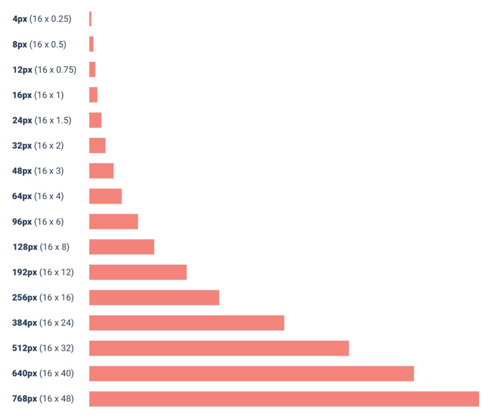

--- 
tags:
---

# Establish a spacing and sizing system

Limit yourself to a restricted set of values. Do not choose values from a linear scale (increase of 4 px for example). Choose on a relational scale, for example in 25% increases.

Example of size system:
Start with 16 px, can be divided properly and is default font for web browser.

Choose values from that scale when for example deciding for a margin.

---
References:
[[refactoring-ui]]
[[layout-and-spacing]]

[//begin]: # "Autogenerated link references for markdown compatibility"
[refactoring-ui]: refactoring-ui.md "Refactoring UI"
[layout-and-spacing]: structure/layout-and-spacing.md "Layout and Spacing"
[//end]: # "Autogenerated link references"