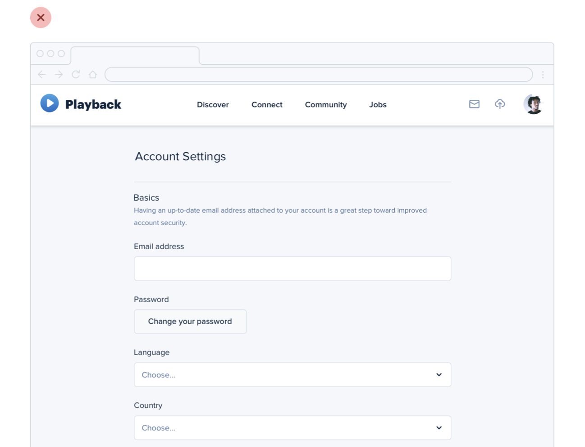
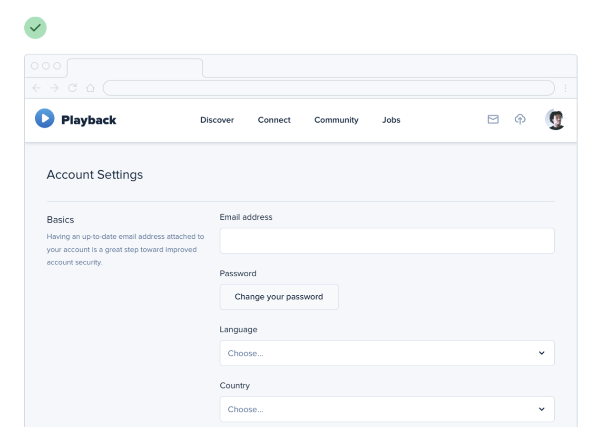

--- 
tags:
---

# You don't have to fill the whole screen

When working with a canvas to design a responsive web application, start with the mobile application first. Think about the use cases handled in the mobile and in the web application. Maybe the mobile application is just for overview, web application is for creation. 

When working with long forms, single column layout, think about breaking it up into two columns.

---
References:
[[refactoring-ui]]

[//begin]: # "Autogenerated link references for markdown compatibility"
[refactoring-ui]: refactoring-ui.md "Refactoring UI"
[//end]: # "Autogenerated link references"