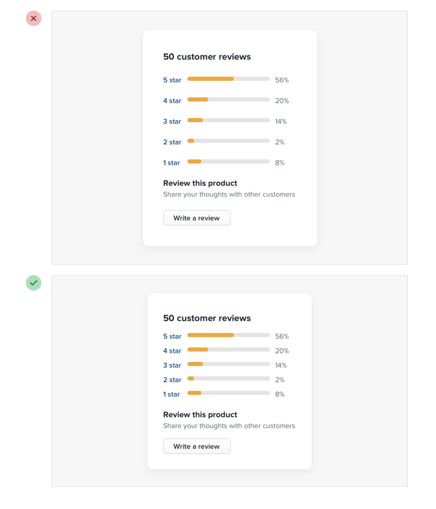

--- 
tags:
---

# Start with too much white space

Simple Insight: Give something space, is the easiest way to make something look better.
Start with way too much whitespace and reduce it till it looks good

Don't overuse this technique since dense UIs like a Dashboard have their place.

---
References:
[[refactoring-ui]]

[//begin]: # "Autogenerated link references for markdown compatibility"
[refactoring-ui]: refactoring-ui.md "Refactoring UI"
[//end]: # "Autogenerated link references"