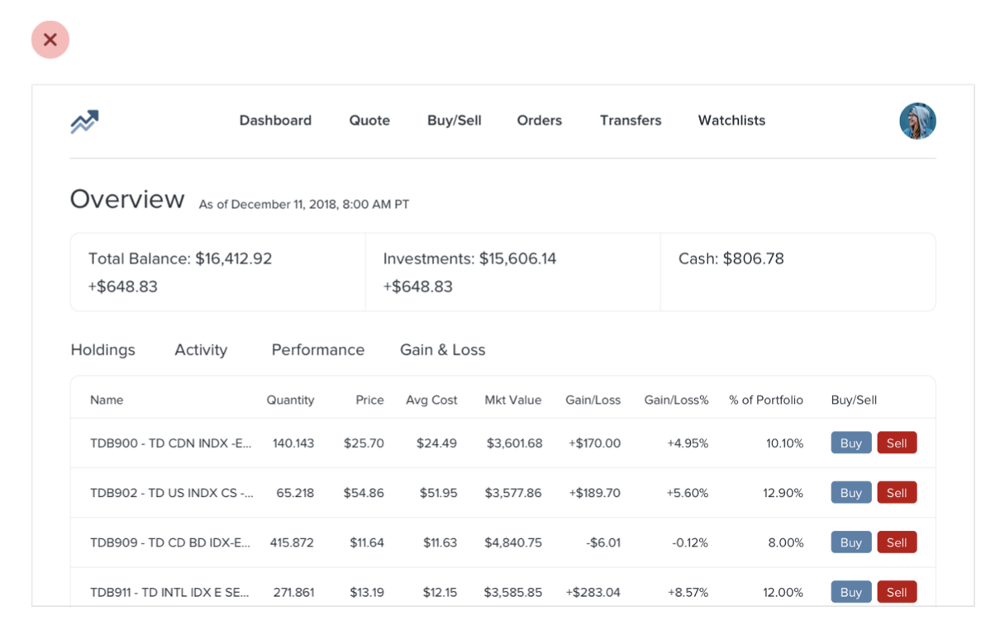

--- 
tags:
---

# Hierarchy is everything

It is a key objective of UX design to make navigating the application as easy as possible. Interfaces can display lots of information, without having to be chaotic or depressing. 

This can be achieved by introducing hierarchy to the application in all sorts of ways. Tips on how to do that, are listed below. 

[[size-isnt-everything]]
[[dont-user-grey-text]]
[[emphasize-deemphasize]]
[[labels-are-last-resort]]
[[separate-visual-from-document-hierarchy]]
[[balance-weight-contrast]]
[[semantics-secondary]]

---
References:
[[refactoring-ui]]

[//begin]: # "Autogenerated link references for markdown compatibility"
[size-isnt-everything]: ../size-isnt-everything.md "Size isn't everything"
[dont-user-grey-text]: ../dont-user-grey-text.md "Don't user grey text on colored backgrounds"
[emphasize-deemphasize]: ../emphasize-deemphasize.md "Emphasize by de-emphasizing"
[labels-are-last-resort]: ../labels-are-last-resort.md "Labels are a last resort"
[separate-visual-from-document-hierarchy]: ../separate-visual-from-document-hierarchy.md "Separate visual hierarchy from document hierarchy"
[balance-weight-contrast]: ../balance-weight-contrast.md "Balance weight and contrast"
[semantics-secondary]: ../semantics-secondary.md "Semantics are secondary"
[refactoring-ui]: ../refactoring-ui.md "Refactoring UI"
[//end]: # "Autogenerated link references"