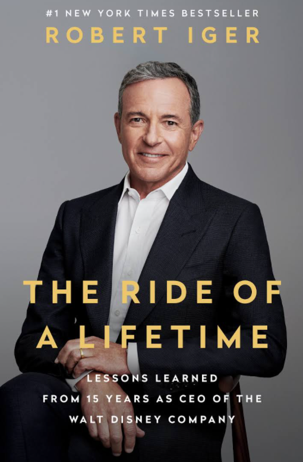

---
tags:
---

# The ride of a lifetime
## lessons learned from 15 years as CEO of the Walt Disney Company

*Length*: 247 (kindle edition)

*Content in 3 sentences*:
Bob Igler describes his professional journey starting at ABC with coordinating light shows as a "runner", raising within the company, leading it, and being acquired by Disney. Soon to be number two, next to Michael Eisner and eventually becoming CEO in 2005. He describes his measures in shaping the company to be future-proof through technological bets and acquisitions of major players in the media industry (Pixar, Lucasfilm, Marvel, 20th century Fox). Along the way he shares insights into leadership practices that turned out to work for him. 

*Author*: [[bob-igler]]

*Web*: https://www.amazon.de/Ride-Lifetime-Lessons-Learned-Company/dp/0399592091/ref=sr_1_1?adgrpid=70226788559&dchild=1&gclid=CjwKCAjwxuuCBhATEiwAIIIz0QbW6NzeMjTOtWoMnFeZCHUpKKEPADJer3-00CLqqeYMd8bZ4iBl2hoC21YQAvD_BwE&hvadid=352898398709&hvdev=c&hvlocphy=9042079&hvnetw=g&hvqmt=e&hvrand=15480486386714280681&hvtargid=kwd-296698396531&hydadcr=27527_1736757&keywords=the+ride+of+a+lifetime&qid=1616572959&sr=8-1

[//begin]: # "Autogenerated link references for markdown compatibility"
[bob-igler]: ../../personalities/bob-igler.md "Robert Allen ("Bob") Igler"
[//end]: # "Autogenerated link references"