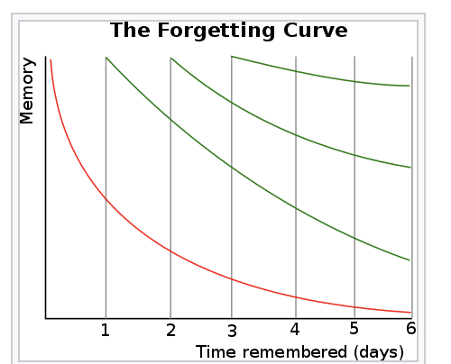

--- 
tags: learning, memory
---

# Die Vergessens-Kurve

Das Prinzip der Vergessenskurve besagt, dass der Grad an Information, den man nach einem initialen Lernen behält mit der Zeit absinkt, wenn man das gelernte nicht wiederholt.
Die ersten 24 Stunden nach dem initialen Lernen sind entscheidend und trägt zum besseren nicht vergessen bei. 
Das Wiederholen von Inhalten nach gewissen Zeitabständen verlangsamt den Informationsverlust zusehends, wobei gilt, dass je öfter man etwas wiederholt, desto größer können die Abstände zwischen den Wiederholungen werden, bis die Vergessenskurve "ganz" abflacht und man Information im Langzeitgedächtnis aufgenommen hat.

Die Vergessenskurve und Ihre Verlangsamung wurde von Hermann Ebbinghouse theoretisiert und erforscht.

---
References:
- https://en.wikipedia.org/wiki/Forgetting_curve (28.01.2021)