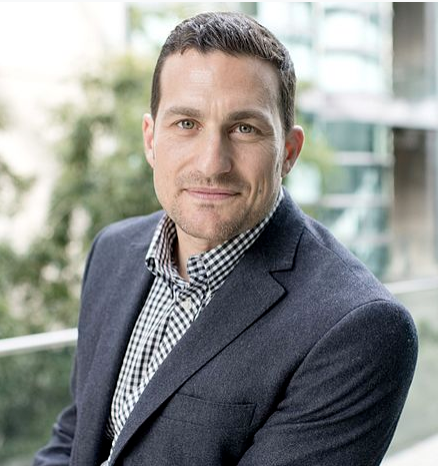

--- 
tags:
---

# Andrew Huberman

Profession(s): Neuroscience professor at Standford University school for medicine. Podcast host of [[hubermanlab]]
Story: Fatherless, nearly motherless grown up, several times thrown out of school, shifted his life around with science and education
Web: https://www.hubermanlab.com/

[//begin]: # "Autogenerated link references for markdown compatibility"
[hubermanlab]: ../podcasts/hubermanlab/hubermanlab.md "hubermanlab"
[//end]: # "Autogenerated link references"